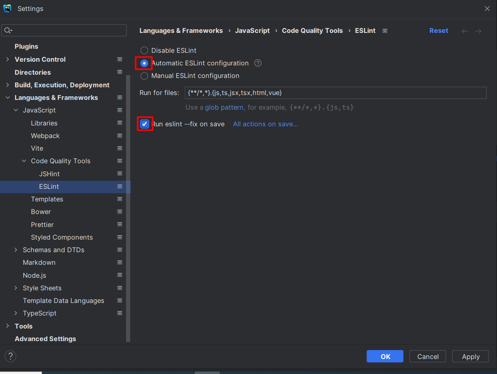

# Настройки для Webstorm
- Скачать папку settings на свой PC
- Нажать на кнопку `File`(вверхний левый угол при стандартных настройках)
- Открываем `Manage IDE Settings`
- Нажимаем `Import Settings`
- Указываете путь до папки settings которую вы скачали в самом начале

# Добавление eslint в проект
## Установка зависимостей
### JS
- `npm install --save-dev eslint eslint-plugin-vue`
### TS
- `npm install --save-dev eslint eslint-plugin-vue @vue/eslint-config-typescript @typescript-eslint/parser @typescript-eslint/eslint-plugin`

Создаем файл в корневой директории проекта с название:
- `.eslintrc.js`

Добавляем в него следующий код:
### JS

```rb
module.exports = {
  extends: [
    'plugin:vue/recommended',
    'eslint:recommended',
  ],
  rules: {
    semi: ['error', 'never']
  }
}
```
### TS
```rb
// eslint-disable-next-line no-undef
module.exports = {
  extends: [
    'plugin:vue/recommended',
    'eslint:recommended',
    '@vue/typescript/recommended'
  ],
  parserOptions: {
    parser: '@typescript-eslint/parser'
  },
  rules: {
    semi: ['error', 'never']
  }
}
```

Заходим в настройки webstrom 'CTRL+ALT+S'. В поиске вводим ESLint.Ставим необходимые галочки

Нажимаем Apply и OK

> **Не забывайте утснавливать эти флаги при работе на новых проектах**!!!
# Добавляем alias
Файл vite.config должен выглядеть так
```rb
import { defineConfig } from 'vite'
import vue from '@vitejs/plugin-vue'
import { resolve } from 'path'

export default defineConfig({
  resolve: {
    alias: {
      '@': resolve(__dirname, 'src')
    }
  },
  plugins: [vue()]
})
```